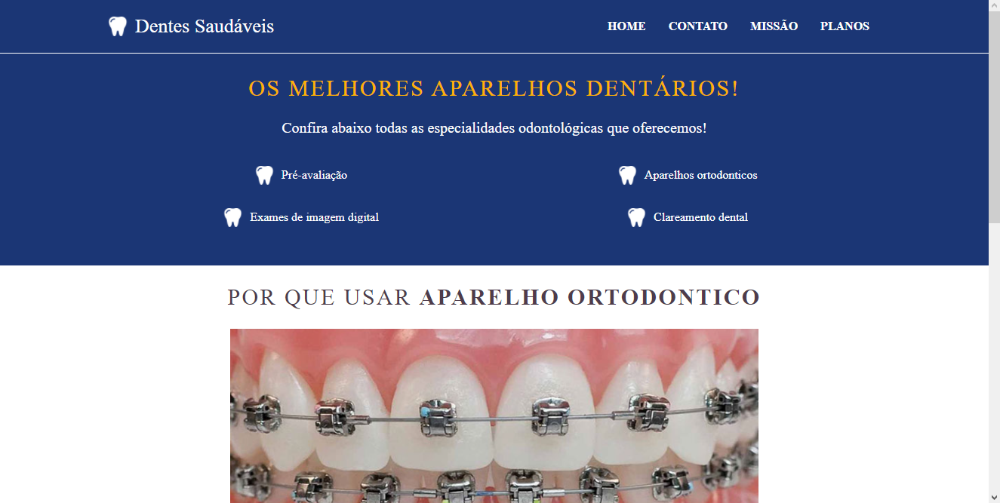
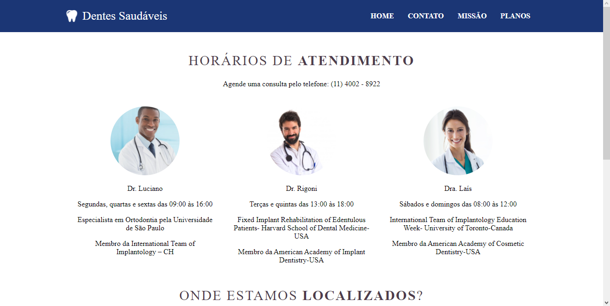
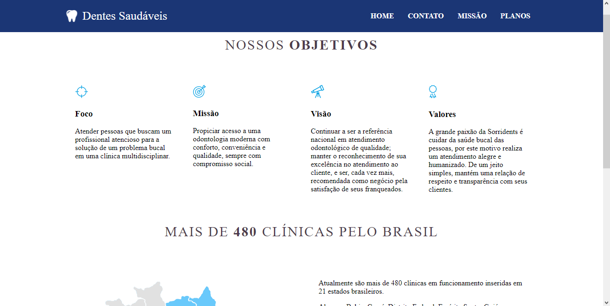
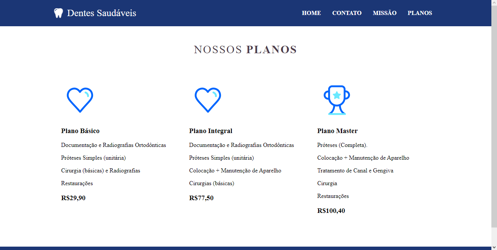

- Site consultório - Setembro 2021, por Vitor Benedito

Como abrir o projeto:

- Para iniciar o projeto primeiramente clone o repositório em sua máquina com o seguinte comando: git clone https://github.com/VitorBsdc/consultorio.git

- Após clonar ainda em seu Terminal utilize o próximo comando: cd consultorio
- Posteriormente você precisará ter o node instalado em sua máquina assim utilize: npm install
- Após instalar as dependências do projeto utilize: npm start

O projeto será aberto em seu navegador.

Projeto: 

- Home

- Contato

- Missão

- Planos

Dificuldades enfrentadas: 

Por se tratar de uns dos primeiros contato com a tecnologia React, tive dificuldade em entender com clareza a forma de se utilizar Props.

